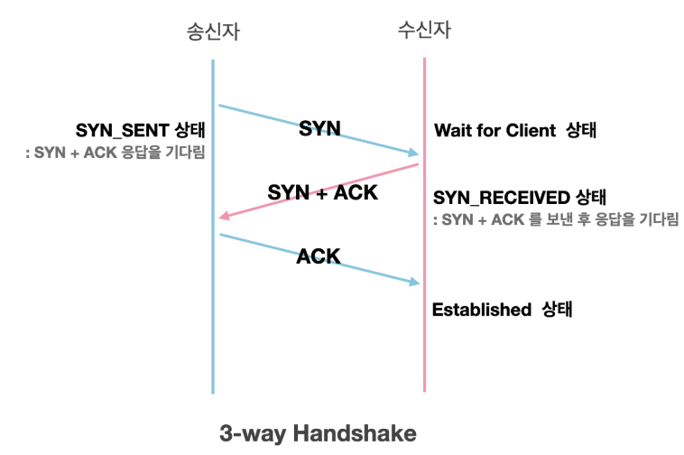
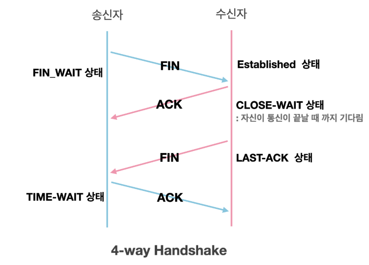

# 3-Way Handshake

TCP 3-Way Handshakee는 TCP/IP 네트워크에서 안정적이고 연결 지향적인 통신을 설정하기 위해 사용되는 절차입니다. 

이 절차는 클라이언트와 서버 간에 신뢰할 수 있는 연결을 설정하기 위해 세 개의 메시지(세그먼트)를 교환하는 과정을 포함합니다.

### **1단계: SYN (SYN_SENT)**
- **클라이언트**가 서버에 연결을 요청하는 SYN 세그먼트를 전송
- 클라이언트는 `SYN_SENT` 상태가 됨
- 초기 순서 번호(Sequence Number)와 윈도우 크기(Window Size) 정보가 포함됨

### **2단계: SYN + ACK (SYN_RECEIVED)**
- **서버**가 클라이언트의 요청을 수락하고 SYN과 ACK 플래그가 설정된 세그먼트를 전송
- 서버는 `SYN_RECEIVED` 상태가 됨
- 서버의 초기 순서 번호와 클라이언트의 초기 순서 번호에 대한 응답(ACK=클라이언트의 초기 순서 번호 + 1)을 포함

### **3단계: ACK (ESTABLISHED)**
- **클라이언트**가 서버의 응답을 확인하고 ACK 플래그가 설정된 세그먼트를 전송
- 클라이언트와 서버 모두 `ESTABLISHED` 상태가 됨
- 서버의 순서 번호에 대한 응답(ACK=서버의 초기 순서 번호 + 1)을 포함
- 이 절차가 완료되면 클라이언트와 서버 간에 신뢰할 수 있는 연결이 설정되고, 데이터 전송이 시작될 수 있습니다.

### **3-Way Handshake 상태 변화**

| 단계 | 클라이언트 상태 | 서버 상태 | 설명 |
|------|----------------|-----------|------|
| **1단계** | `SYN_SENT` | `LISTEN` | 클라이언트가 SYN 전송, 서버는 연결 요청 대기 |
| **2단계** | `SYN_SENT` | `SYN_RECEIVED` | 서버가 SYN+ACK 전송 |
| **3단계** | `ESTABLISHED` | `ESTABLISHED` | 클라이언트가 ACK 전송, 연결 완료 |

## 🤷🏻‍♂️ 그럼 TCP 연결 종료할 때는 어떻게 하나요?

TCP 연결 종료는 4-Way Handshake를 통해 이루어집니다. 연결 설정과 달리 종료는 양방향으로 각각 독립적으로 이루어져야 하기 때문에 4단계가 필요합니다.

### **1단계: FIN (FIN_WAIT_1)**
- **클라이언트**가 연결 종료를 요청하는 FIN 세그먼트를 서버에 전송
- 클라이언트는 `FIN_WAIT_1` 상태가 됨
- 더 이상 데이터를 보내지 않겠다는 의미

### **2단계: ACK (CLOSE_WAIT)**
- **서버**가 클라이언트의 FIN 요청을 받고 ACK로 응답
- 서버는 `CLOSE_WAIT` 상태가 됨
- 클라이언트는 `FIN_WAIT_2` 상태가 됨
- 서버는 아직 보낼 데이터가 있을 수 있음

### **3단계: FIN (LAST_ACK)**
- **서버**가 자신의 데이터 전송을 완료하고 FIN 세그먼트를 클라이언트에 전송
- 서버는 `LAST_ACK` 상태가 됨
- 서버도 더 이상 데이터를 보내지 않겠다는 의미

### **4단계: ACK (TIME_WAIT)**
- **클라이언트**가 서버의 FIN 요청을 받고 ACK로 응답
- 클라이언트는 `TIME_WAIT` 상태가 됨
- 이후 양쪽 모두 `CLOSED` 상태가 되어 연결이 완전히 종료됨

### **4-Way Handshake 상태 변화**

| 단계 | 클라이언트 상태 | 서버 상태 | 설명 |
|------|----------------|-----------|------|
| **1단계** | `FIN_WAIT_1` | `ESTABLISHED` | 클라이언트가 FIN 전송 |
| **2단계** | `FIN_WAIT_2` | `CLOSE_WAIT` | 서버가 ACK 전송 |
| **3단계** | `FIN_WAIT_2` | `LAST_ACK` | 서버가 FIN 전송 |
| **4단계** | `TIME_WAIT` | `CLOSED` | 클라이언트가 ACK 전송 |
| **완료** | `CLOSED` | `CLOSED` | 연결 완전 종료 |

## 🤷🏻‍♂️ 각 상태별 의미가 궁금합니다.

### **상태별 상세 설명**

#### **3-Way Handshake 상태**
- **`CLOSED`**: 초기 상태, 연결 없음
- **`LISTEN`**: 서버가 연결 요청 대기 중
- **`SYN_SENT`**: 클라이언트가 SYN 전송 후 대기
- **`SYN_RECEIVED`**: 서버가 SYN 수신 후 SYN+ACK 전송
- **`ESTABLISHED`**: 연결 완료, 데이터 전송 가능

#### **4-Way Handshake 상태**
- **`FIN_WAIT_1`**: 클라이언트가 FIN 전송 후 서버 ACK 대기
- **`FIN_WAIT_2`**: 서버 ACK 수신 후 서버 FIN 대기
- **`CLOSE_WAIT`**: 서버가 클라이언트 FIN 수신, 자신의 FIN 전송 대기
- **`LAST_ACK`**: 서버가 FIN 전송 후 클라이언트 ACK 대기
- **`TIME_WAIT`**: 클라이언트가 ACK 전송 후 2MSL 대기
- **`CLOSED`**: 연결 완전 종료