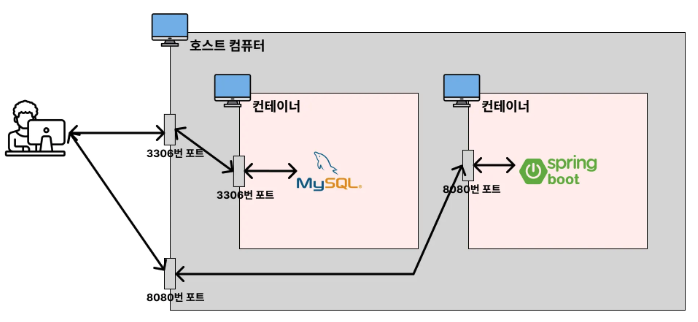

# Docker Compose를 사용하는 이유

## 🤷🏻‍♂️ Docker Copmose란?

여러 개의 Docker 컨테이너들을 하나의 서비스로 정의하고 구성해 하나의 묶음으로 관리할 수 있게 도와주는 툴입니다.

## 🤷🏻‍♂️ Docker Compose를 사용하는 이유는 무엇인가요?

1. 여러 개의 컨테이너를 관리하는 데 용이
    
여러 개의 컨테이너로 이루어진 복잡한 애플리케이션을 한 번에 관리할 수 있게 해줍니다. 여러 컨테이너를 하나의 환경에서 실행하고 관리하는 데 도움이 됩니다.
    
2. 복잡한 명령어로 실행시키던 걸 간소화 시킬 수 있음

## 🤷🏻‍♂️ 컨테이너로 실행시킨 Spring Boot가 MySQL에 연결이 안 되는 이유가 무엇인가요?



각각의 컨테이너는 자신만의 네트워크망과 IP 주소를 가지고 있습니다. 호스트 컴퓨터 입장에서 localhost는 호스트 컴퓨터를 가리키지만, Spring Boot 컨테이너 입장에서 localhost는 Spring Boot 컨테이너를 가리킵니다.

그렇기 때문에 주소명에 docker compose 서비스 명과 동일하게 넣어줘야 합니다.

```yml
spring:
  datasource:
    url: jdbc:mysql://my-db:3306/mydb
    username: root
    password: pwd1234
    driver-class-name: com.mysql.cj.jdbc.Driver
```

이는 Redis를 사용할 때도 동일하게 적용됩니다.

```yml
spring:
  datasource:
    url: jdbc:mysql://my-db:3306/mydb
    username: root
    password: pwd1234
    driver-class-name: com.mysql.cj.jdbc.Driver
  data:
    redis:
      host: localhost
      host: my-cache-server
      port: 6379
```