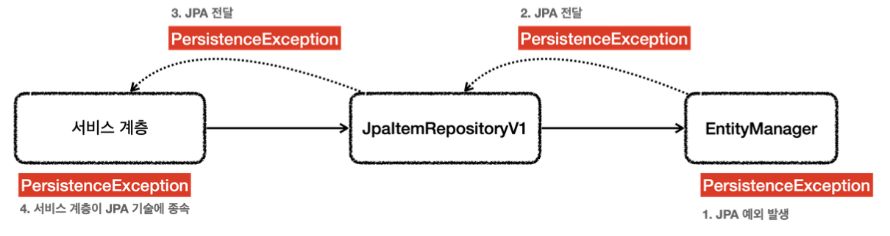
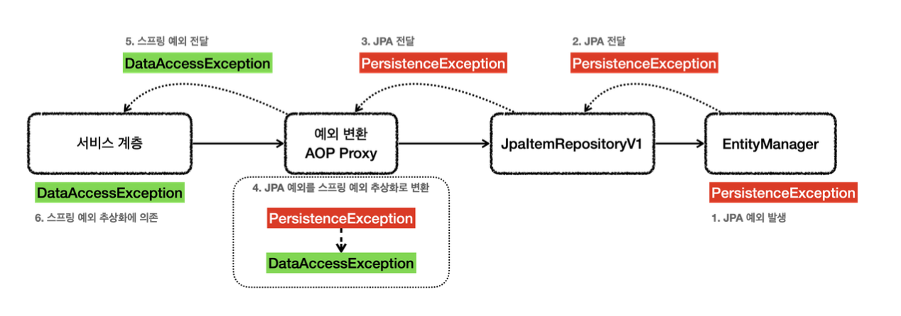

# JPA

스프링과 JPA는 자바 기업 시장의 주력 기술입니다. 스프링이 DI 컨테이너를 포함한 애플리케이션 전반의 다양한 기능을 제공한다면, JPA는 ORM 데이터 접근 기술을 제공합니다.

## JPA 설정

`spring-boot-starter-data-jpa` 라이브러리를 사용한다면 JPA와 스프링 데이터 JPA를 스프링 부트와 통합하고, 설정도 아주 간단합니다. 

`build.gradle`에 아래 의존 관계를 추가하면 사용할 수 있습니다.

`implementation 'org.springframework.boot:spring-boot-starter-data-jpa'`

## JPA 적용 - 개발

JPA에서 가장 중요한 부분은 객체와 테이블을 매핑하는 것입니다. 아래 Item 객체와 테이블을 매핑해 보겠습니다.

```java
@Data
@Entity
public class Item {
    @Id @GeneratedValue(strategy = GenerationType.IDENTITY)
    private Long id;

    @Column(name = "item_name", length = 10)
    private String itemName;

    private Integer quantity;

    public Item() {
    }

    public Item(String itemName, Integer price, Integer quantity) {
        this.itemName = itemName;
        this.price = price;
        this.quantity = quantity;
    }
}
```

위 코드를 분석하면 아래와 같습니다.

- `@Entity` : JPA가 사용하는 객체라는 뜻입니다. 이 에노테이션이 있어야 JPA가 인식할 수 있습니다. 이렇게 `@Entity` 가 붙은 객체를 JPA에서는 엔티티라 합니다.
- `@Id` : 테이블의 PK와 해당 필드를 매핑합니다.
- `@GeneratedValue(strategy = GenerationType.IDENTITY)` : PK 생성 값을 데이터베이스에서 생성하는 `IDENTITY` 방식을 사용합니다.
- `@Column` : 객체의 필드를 테이블의 컬럼과 매핑합니다.

JPA에서 `public` 또는 `protected`의 기본 생성자는 필수이므로 꼭 넣어줘야 합니다.

이제 이 JPA를 활용한 코드는 아래와 같습니다.

```java
@Slf4j
@Repository
@Transactional
public class JpaItemRepositoryV1 implements ItemRepository {
    private final EntityManager em;

    public JpaItemRepositoryV1(EntityManager em) {
        this.em = em;
    }
    
    @Override
    public Item save(Item item) {
        em.persist(item);
        return item;
    }
    
    @Override
    public void update(Long itemId, ItemUpdateDto updateParam) {
        Item findItem = em.find(Item.class, itemId);
        findItem.setItemName(updateParam.getItemName());
        findItem.setPrice(updateParam.getPrice());
        findItem.setQuantity(updateParam.getQuantity());
    }
    
    @Override
    public Optional<Item> findById(Long id) {
        Item item = em.find(Item.class, id);
        return Optional.ofNullable(item);
    }
    
    @Override
    public List<Item> findAll(ItemSearchCond cond) {
        String jpql = "select i from Item i";
        Integer maxPrice = cond.getMaxPrice();
        String itemName = cond.getItemName();
        if (StringUtils.hasText(itemName) || maxPrice != null) {
        jpql += " where";
    }

    boolean andFlag = false;

    if (StringUtils.hasText(itemName)) {
        jpql += " i.itemName like concat('%',:itemName,'%')";
        andFlag = true;
    }

    if (maxPrice != null) {
        if (andFlag) {
            jpql += " and";
        }
        jpql += " i.price <= :maxPrice";
    }

    log.info("jpql={}", jpql);
    TypedQuery<Item> query = em.createQuery(jpql, Item.class);
    if (StringUtils.hasText(itemName)) {
        query.setParameter("itemName", itemName);
    }

    if (maxPrice != null) {
        query.setParameter("maxPrice", maxPrice);
    }

    return query.getResultList();
    }
}
```

- `pirvate final EntityManger em` : JPA의 모든 동작은 엔티티 매니저를 통해서 이루어집니다. 엔티티 매니저는 내부의 데이터 소스를 가지고 있으며, 데이터베이스에 접근할 수 있습니다.
- `@Transactional` : JPA의 모든 데이터 변경은 트랜잭션 안에서 이루어져야 합니다. 하지만 조회는 트랜잭션이 없어도 사용 가능합니다. 

## JPA 적용 - 분석 

### save() - 저장

```java
public Item save(Item item) {
    em.persist(item);
    return item;
}
```

`em.persist(item)` : JPA에서 객체를 테이블에 저장할 때는 엔티티 매니저가 제공하는 `persist()` 메서드를 사용합니다.

JPA에서는 아래와 같은 SQL를 만들어서 실행하게 됩니다.

```sql
insert into item (id, item_name, price, quantity) values (null, ?, ?, ?)

또는

insert into item (id, item_name, price, quantity) values (default, ?, ?, ?)

또는

insert into item (item_name, price, quantity) values (?, ?, ?)
```

JPA가 만들어서 실행한 SQL을 보면 `id`에 값이 빠져있는 것을 확인할 수 있습니다. 이는 PK 키 생성 전략을 `IDENTITY`로 사용했기 때문에 JPA가 이렇게 쿼리를 만들어서 생성하게 된 것입니다.

물론 커리 실행 이후 Item 객체의 `id` 필드에는 데이터베이스가 생성한 PK 값이 들어가게 됩니다.

### update() - 수정

```java
public void update(Long itemId, ItemUpdateDto updateParam) {
    Item findItem = em.find(Item.class, itemId);
    findItem.setItemName(updateParam.getItemName());
    findItem.setPrice(updateParam.getPrice());
    findItem.setQuantity(updateParam.getQuantity());
}
```

JPA에서는 아래와 같은 SQL를 만들어서 실행하게 됩니다.

```sql
update item set item_name=?, price=?, quantity=? where id=?
```

위에서 보면 `em.update()` 같은 메서드가 호출되지 않았음에도 UPDATE SQL이 실행된 걸 볼 수 있습니다. 

이는 JPA는 트랜잭션이 커밋되는 시점에 변경된 엔티티 객체가 있는지 확인합니다. 특정 엔티티 객체가 변경된 경우에는 UPDATE SQL를 실행하게 됩니다.

## findById() - 단건 조회

```java
public Optional<Item> findById(Long id) {
    Item item = em.find(Item.class, id);
    return Optional.ofNullable(item);
}
```

JPA에서 엔티티 객체를 PK를 기준으로 조회할 때는 `find()`를 사용하고 조회 타입과 PK 값을 주면 됩니다. 그러면 JPA가 다음과 같은 조회 SQL을 만들어서 실행하고, 결과를 객체로 바로 변환해 줍니다.

JPA에서는 아래와 같은 SQL를 만들어서 실행하게 됩니다.

```sql
select
    item0_.id as id1_0_0_,
    item0_.item_name as item_nam2_0_0_,
    item0_.price as price3_0_0_,
    item0_.quantity as quantity4_0_0_
from item item0_
where item0_.id=?
```

## findAll() - 목록 조회

```java
public List<Item> findAll(ItemSearchCond cond) {
    String jpql = "select i from Item i";
    //동적 쿼리 생략
    TypedQuery<Item> query = em.createQuery(jpql, Item.class);
    return query.getResultList();
}
```

> **JPQL이란?**
> JPA는 JPQL(Java Persistence Query Language)이라는 객체지향 쿼리 언어를 제공합니다.
> 주로 여러 데이터를 복잡한 조건으로 조회할 때 사용합니다.

실행된 JPQL은 아래와 같습니다.

```sql
select i from Item i
where i.itemName like concat('%',:itemName,'%')
    and i.price <= :maxPrice
```

JPQL에서는 아래와 같은 SQL를 만들어서 실행하게 됩니다.

```sql
select
    item0_.id as id1_0_,
    item0_.item_name as item_nam2_0_,
    item0_.price as price3_0_,
    item0_.quantity as quantity4_0_
from item item0_
where (item0_.item_name like ('%'||?||'%'))
and item0_.price<=?
```

## JPA 적용 - 예외 변환

`EntityManager`는 순수한 JPA 기술이고, 스프링과는 관계가 없습니다. 따라서 엔티티 매니저는 예외가 발생하면 JPA 관련 예외를 발생시킵니다.

JPA는 `PersistenceException`과 그 하위 예외를 발생시킵니다. 그래서 JPA 예외를 스프링 에외 추상화(`DataAccessException`)로 `@Repository`를 통해 변환시킬 수 있습니다.

### 예외 변환 전



### 예외 변환 후



**`@Repository` 기능**
- `@Repository` 가 붙은 클래스는 컴포넌트 스캔의 대상이 됩니다.
- `@Repository` 가 붙은 클래스는 예외 변환 AOP의 적용 대상이 됩니다.

결과적으로 레포지토리에 `@Repository` 애노테이션만 있으면, 스프링이 예외 변환을 처리하는 AOP를 만들어 줍니다.