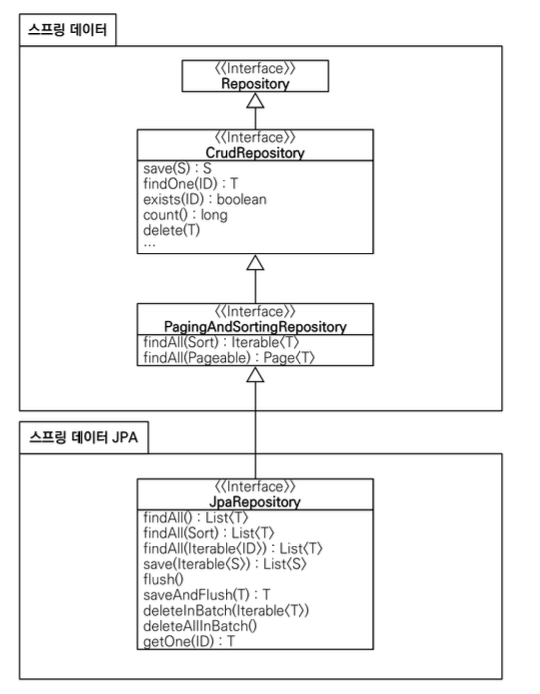

# Spring Data JPA

스프링 데이터 JPA는 JPA를 편리하게 사용할 수 있도록 도와주는 라이브러리입니다. 수많은 편리한 기능을 제공하지만, 가장 대표적인 기능으로는 다음과 같습니다.

- 공통 인터페이스 기능
- 쿼리 메서드 기능



- `JpaRepository` 인터페이스를 통해서 기본적인 CRUD 기능을 제공합니다.
- 공통화 가능한 기능이 거의 모두 포함되어 있습니다.
- `CrudRepository`에서 `findOne()` -> `findById()`로 변경되었습니다.

## `JpaRepository` 사용법

```java
public interface ItemRepository extends JpaRepository<Item, Long> {
}
```

`JpaRepository` 인터페이스를 인터페이스 상속받고, 제너릭에 관리할 <엔티티, 엔티티ID>를 주면 됩니다. 그러면 `JpaRepository`가 제공하는 기본 CRUD 기능을 모두 사용할 수 있습니다.

`JpaRepository` 인터페이스만 상속받으면 스프링 데이터 JPA가 프록시 기술을 사용해서 구현 클래스를 만들어줍니다. 그리고 만든 구현 클래스의 인스턴스를 만들어서 스프릥 빈으로 등록합니다. 따라서 개발자는 구현 클래스 없이 인터페이스만 만들면 기본 CRUD 기능을 사용할 수 있습니다.

## 쿼리 메서드 기능

스프링 데이터 JPA는 인터페이스에 메서드만 적어두면, 메서드 이름을 분석해서 쿼리를 자동으로 만들고 실행해주는 기능을 제공합니다.

만약 순수 JPA를 사용하면, 직접 JPQL을 작성하고 파라미터도 직접 바이딩해야 합니다. 하지만 스프링 데이터 JPA는 메서드 이름을 분석해서 필요한 JPQL을 만들고 실행해 줍니다. 