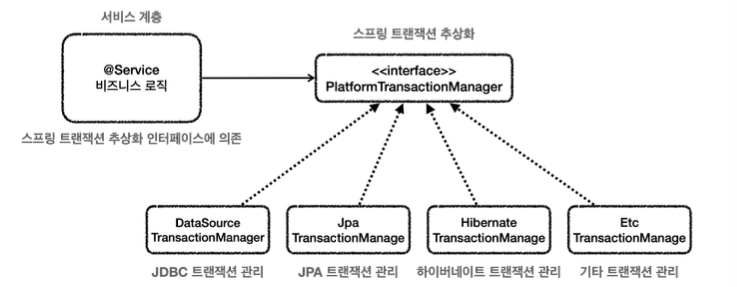

# Transaction 이해

각각의 데이터 접근 기술들은 트랜잭션을 처리하는 방식에 차이가 있습니다. 그래서 JDBC 기술을 사용하다가 JPA 기술로 변경하게 되며 트랜잭션을 사용하는 코드도 모두 변경해야 합니다. 

스프링은 이런 문제를 해결하기 위해서 트랜잭션 추상화를 제공합니다. 트랜잭션을 사용하는 입장에서는 스프링 트랜잭션 추상화를 통해 둘을 동일한 방식으로 사용할 수 있게 되는 것입니다.

스프링은 `PlatformTransactionManager`라는 인터페이스를 통해 트랜잭션을 추상화합니다.



- 스프링은 트랜잭션을 추상화해서 제공할 뿐만 아니라, 실무에서 주로 사용하는 데이터 접근 기술에 대한 트랜잭션 매니저의 구현체도 제공합니다. 
- 스프링 부트는 어떤 데이터 접근 기술을 사용하는지를 자동으로 인식해서 적절한 트랜잭션 매니저를 선택해서 스프링 빈으로 등록해주기 때문에 트랜잭션 매니저를 선택하고 등록하는 과정을 생략할 수 있습니다.

## 스프링 트랜잭션 사용 방식

`PlatformTransactionManager`를 사용하는 방법으로는 크게 2가지가 존재합니다.

선언적 트랜잭션 관리(Declarative Transaction Management)
- `@Transactional` 애노테이션 하나만 선언해서 매우 편리하게 트랜잭션을 적용하는 것을 선언적 트랜잭
션 관리라 합니다.
- 선언적 트랜잭션 관리는 과거 XML에 설정하기도 했습니다.
- 이름 그대로 해당 로직에 트랜잭션을 적용하겠다라고 어딘가에 선언하기만 하면 트랜잭션이 적용되는 방식입니다.
- 프로그래밍 방식에 비해서 훨씬 간편하고 실용적이기 때문에 실무에서는 대부분 선언적 트랜잭션 관리를 사용합니다.

프로그래밍 방식의 트랜잭션 관리(programmatic transaction management)
- 트랜잭션 매니저 또는 트랜잭션 템플릿 등을 사용해서 트랜잭션 관련 코드를 직접 작성하는 것을 프로그래밍 방식의 트랜잭션 관리라 합니다.
- 애플리케이션 코드가 트랜잭션이라는 기술 코드와 강하게 결합하게 됩니다.

## 선언적 트랜잭션 AOP

`@Transactional` 을 통한 선언적 트랜잭션 관리 방식을 사용하게 되면 기본적으로 프록시 방식의 AOP가 적용됩니다.

처음 트랜잭션을 처리하기 위한 프록시를 도입하기 전에는 서비스의 로직에서 트랜잭션을 직접 시작했습니다.

```java
TransactionStatus status = transactionManager.getTransaction(new
DefaultTransactionDefinition());

try {
    //비즈니스 로직
    bizLogic(fromId, toId, money);
    transactionManager.commit(status); //성공시 커밋
} catch (Exception e) {
    transactionManager.rollback(status); //실패시 롤백
    throw new IllegalStateException(e);
}
```

프록시 도입 후에는 트랜잭션을 처리하기 위한 프록시를 적용하면 트랜잭션을 처리하는 객체와 비즈니스 로직을 처리하는 서비스 객체를 명
확하게 분리할 수 있게 되었습니다.

- 프록시 도입 전 : 서비스에 비즈니스 로직과 트랜잭션 처리 로직이 함께 섞여있습니다.
- 프록시 도입 후 : 트랜잭션 프록시가 트랜잭션 처리 로직을 모두 가져갑니다. 그리고 트랜잭션을 시작한 후에 실제 서비스를 대신 호출합니다. 트랜잭션 프록시 덕분에 서비스 계층에는 순수한 비즈니즈 로직만 남길 수 있습니다.

## 스프링이 제공하는 트랜잭션 AOP

- 스프링의 트랜잭션은 매우 중요한 기능이고, 전세계 누구나 다 사용하는 기능이다. 스프링은 트랜잭션 AOP를 처리하기 위한 모든 기능을 제공한다. 스프링 부트를 사용하면 트랜잭션 AOP를 처리하기 위해 필요한 스프링 빈들도 자동으로 등록해 줍니다.
- 개발자는 트랜잭션 처리가 필요한 곳에 `@Transactional` 애노테이션만 붙여주면 된다. 스프링의 트랜잭션 AOP는 이 애노테이션을 인식해서 트랜잭션을 처리하는 프록시를 적용해 줍니다.

## 트랜잭션 적용 위치

스프링에서 우선순위는 항상 더 구체적이고 자세한 것이 높은 우선순위를 가집니다.

예를 들어서 메서드와 클래스에 애노테이션을 붙일 수 있다면 더 구체적인 메서드가 더 높은 우선순위를 가집니다. 그리고 인터페이스와 해당 인터페이스를 구현한 클래스에 애노테이션을 붙일 수 있다면 더 구체적인 클래스가 더 높은 우선순위를 가집니다.

## 트랜잭션 AOP 주의 사항 - 프록시 내부 호출

`@Transactional` 을 사용하면 스프링의 트랜잭션 AOP가 적용됩니다. 그리고 트랜잭션 AOP는 기본적으로 프록시 방식의 AOP를 사용합니다. 

따라서 트랜잭션을 적용하려면 항상 프록시를 통해서 대상 객체(Target)을 호출해야 합니다. 만약 프록시를 거치지 않고 대상 객체를 직접 호출하게 되면 AOP가 적용되지 않고, 트랜잭션도 적용되지 않습니다. 즉, 내부 호출은 프록시를 거치지 않기 때문에 트랜잭션을 적용할 수 없습니다.

그래서 이를 해결하기 위해서는 메서드를 별도의 클래스로 분리해야 합니다.

### public 메서드만 트랜잭션 적용

스프링의 트랜잭션 AOP 기능은 `public` 메서드에만 트랜잭션을 적용하도록 기본 설정이 되어있습니다. 그래서 `protected`, `private`, `package-visible`에는 트랜잭션이 적용되지 않습니다.

## 트랜잭션 AOP 주의 사항 - 초기화 시점

스프링 초기화 시점에는 트랜잭션 AOP가 적용되지 않을 수 있습니다. 그래서 `@PostConstruct`와 같은 애노테이션과 트랜잭션을 같이 쓰면 트랜잭션이 적용되지 않습니다. 왜냐하면 초기화 코드가 먼저 호출되고, 그 다음에 트랜잭션 AOP가 적용되기 때문입니다. 따라서 초기화 시점에는 해당 메서드에서 트랜잭션을 획득할 수 없습니다.

이를 해결하기 위해 `ApplicationReadyEvent` 이벤트를 사용하는 것입니다. 이는 트랜잭션 AOP를 포함한 스프링이 컨테이너가 완전히 생성되고 난 후에 이벤트가 붙은 메서드를 호출합니다. 따라서 트랜잭션이 적용됩니다.

## 예외와 트랜잭션 커밋, 롤백

예외 발생시 스프링 트랜잭션 AOP는 예외의 종류에 따라 트랜잭션을 커밋하거나 롤백합니다. 

- 언체크 예외인 `RuntimeException` , `Error`와 그 하위 예외가 발생하면 트랜잭션을 롤백합니다.
- 체크 예외인 `Exception`과 그 하위 예외가 발생하면 트랜잭션을 커밋합니다.
- 정상 응답(리턴)하면 트랜잭션을 커밋합니다.

그렇기 때문에 비지니스 적으로 오류가 있지만, 이를 데이터베이스에 변경을 해주어야 한다면 체크 예외를 활용해야 합니다. 예시로는 게좌이체 실패와 같은 경우가 있습니다.