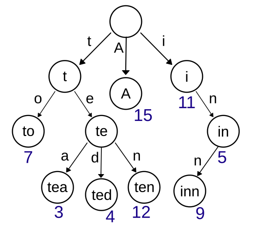

# Trie

자료구조 트라이(Trie)는 문자열을 저장하고 효율적으로 탐색하기 위한 트리 형태의 자료 구조입니다. 트라이는 문자열을 탐색할 때 단순히 비교하는 것에 비해서 효율적으로 찾을 수 있지만, 각 정점이 자식에 대한 링크를 모두 가지고 있기 때문에 저장 공간을 더욱 많이 사용한다는 특징이 있습니다. 주로, 검색어 자동완성이나 사전 찾기 기능을 구현할 때 트라이 자료구조를 고려할 수 있습니다.



## 🤷🏻‍♂️ 트라이는 어떻게 구현할 수 있나요?

트라이 자료구조에서 루트는 항상 비어있으며, 각 간선은 추가될 문자를 키로 가지고 있습니다. 또한, 각 정점은 이전 정점의 값과 간선의 키를 더한 결과를 값으로 가집니다. 트라이를 구현할 때는 이러한 구조를 염두에 두면서 해시 테이블과 연결 리스트를 이용하여 구현할 수 있습니다.

```java
class TrieTest {

    @Test
    void trieTest() {
        Trie trie = new Trie();
        trie.insert("maeilmail");
        assertThat(trie.has("ma")).isTrue();
        assertThat(trie.has("maeil")).isTrue();
        assertThat(trie.has("maeilmail")).isTrue();
        assertThat(trie.has("mail")).isFalse();
    }

    class Trie {

        private final Node root = new Node("");

        public void insert(String str) {
            Node current = root;
            for (String ch : str.split("")) {
                if (!current.children.containsKey(ch)) {
                    current.children.put(ch, new Node(current.value + ch));
                }
                current = current.children.get(ch);
            }
        }

        public boolean has(String str) {
            Node current = root;
            for (String ch : str.split("")) {
                if (!current.children.containsKey(ch)) {
                    return false;
                }
                current = current.children.get(ch);
            }
            return true;
        }
    }

    class Node {

        public String value;
        public Map<String, Node> children;

        public Node(String value) {
            this.value = value;
            this.children = new HashMap<>();
        }
    }
}
```