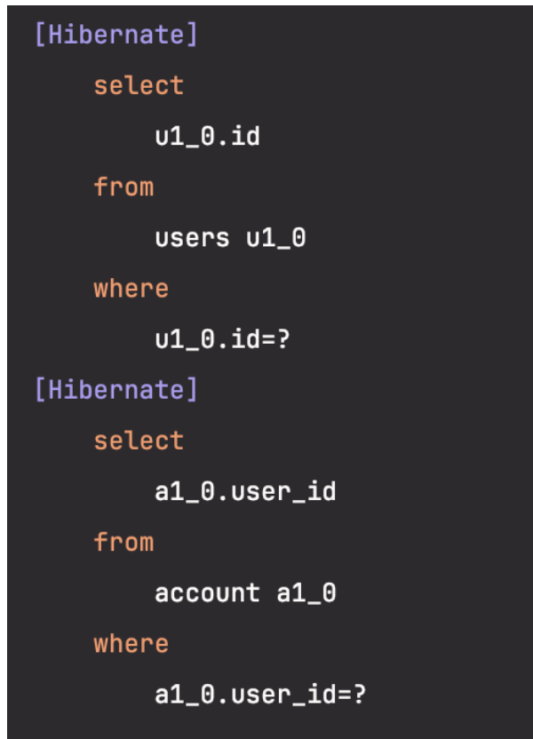

# OneToOne

양방향 `@OneToOne`일 때 연관관계의 주인이 아닌 엔티티를 조회할 경우 Lazy Loading이 동작하지 않습니다.

JPA는 연관된 엔티티가 없으면 null로 초기화하고, 있으면 Lazy Loading이 설정되어 있을 경우 프록시 객체로 초기화합니다. 하지만 데이터베이스의 테이블 관점에서 보면, 연관관계의 주인이 아닌 엔티티는 연관관계를 참조할 FK가 없기 때문에 연관관계의 존재 여부를 알지 못합니다. 그래서 JPA는 null 혹은 프록시 객체 중 무엇으로 초기화할지 결정할 수 없게 되고, 결과적으로 연관된 엔티티의 존재 여부를 확인하는 추가 쿼리를 실행하기 때문에 Lazy Loading이 동작하지 않습니다. JPA의 한계이기 때문에 단방향으로 모델링하거나 Lazy Loading이 정말 필요한 것인지 다시 검토해 보아야 합니다.

```java
@Entity(name = "users")
public class User {

    @Id
    @GeneratedValue(strategy = GenerationType.IDENTITY)
    private Long id;

    @OneToOne(mappedBy = "user", fetch = FetchType.LAZY)
    private Account account;
}

@Entity
public class Account {

    @Id
    @GeneratedValue(strategy = GenerationType.IDENTITY)
    private Long id;

    @OneToOne(fetch = FetchType.LAZY)
    private User user;
}
```

```java
@Test
void lazyTest() {
    userRepository.save(new User());

    userRepository.findById(1L).orElseThrow();
}
```

