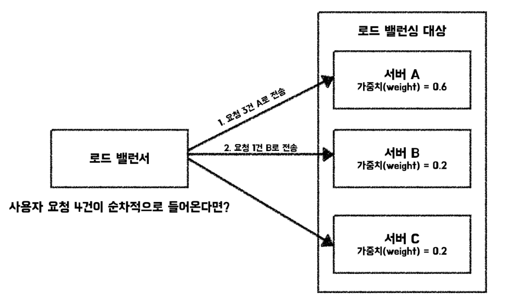

# Load Balancing

로드 밸런싱이란 애플리케이션을 지원하는 리소스 풀에 들어오는 네트워크 트래픽(들어오는 요청)을 균등하게 분산하는 것을 의미합니다. 이를 수행하는 로드 밸런서는 애플리케이션 서버 앞단에 위치하며 클라이언트 요청을 지시하고 제어합니다. 

이를 통해서 애플리케이션의 가용성, 확장성, 보안 및 성능을 확보할 수 있습니다.

## 🤷🏻‍♂️ 알고 계신 로드 밸런싱 알고리즘이 존재하나요?

### 라운드 로빈(Round Robin) 방식 

모든 요청이 순서대로 처리되는 방식입니다. 서버가 3대(A, B, C)가 존재하면 요청은 ABCABC 순서대로 전달됩니다. 모든 서버의 처리 능력이 동등하고, 요청의 고른 분산이 중요한 경우 고려해볼 수 있습니다. 

구현이 쉬우며 고른 분산을 보장한다는 것이 장점입니다. 하지만, 서버 부하나 응답 시간을 고려하지 않고 서버의 처리 능력이 다른 경우 비효율적이라는 것이 단점입니다.

### 가중치 라운드 로빈(Weighted Round Robin) 방식

라운드 로빈 방식에 가중치라는 개념을 추가합니다. 각 서버는 처리 능력과 가용 자원에 따라서 가중치를 할당 받게 됩니다. 그리고, 라운드 로빈 방식을 사용하되 가중치가 높은 서버는 가중치에 비례하여 상대적으로 더욱 많은 요청을 받게 됩니다.

라운드 로빈보다 상대적으로 구현이 복잡하지만 각 서버의 처리 능력을 고려하지 않는다는 라운드 로빈 방식의 단점을 개선합니다. 하지만, 여전히 서버의 상태를 고려하지 않는 방식이라는 점을 유의해야합니다.

### 최소 연결(Least Connections) 방식

각 서버의 활성 연결 수를 모니터링하고 있는 경우에 사용할 수 있습니다. 가장 적은 활성 연결이 존재하는 서버에게 요청을 전달하는 방식입니다. 각 서버의 처리 능력이 다른 경우에는 적합하지 않을 수 있습니다. 처리 능력이 큰 서버는 상대적으로 활성 연결을 더욱 많이 수립할 수 있기 때문입니다. 최소 연결 방식은 각 서버의 처리 능력이 비슷하지만 특정 이유로 한 서버에 동시 연결 수가 많아 지는 상황이 존재하는 경우 고려해볼 수 있습니다.

로드 밸런싱 대상에 상대적으로 처리 능력이 큰 서버가 존재하는 경우에는 라운드 로빈과 마찬가지로 가중치라는 개념을 사용해볼 수 있습니다. 이를 가중치 최소 연결(Weighted Least Connections) 방식이라고 합니다.

### 최소 응답 시간(Least Response Time) 방식

각 서버의 응답 시간을 모니터링하고 있는 경우에 사용할 수 있습니다. 응답 시간이 가장 빠른 서버에 요청을 전달하는 방식입니다. 서버들마다 응답 시간이 다양할 경우, 가장 빠른 서버에 요청을 전달하여 사용자 경험을 개선하는데 도움이 될 수 있습니다. 

응답 시간을 기반으로 하기 때문에 서버의 부하 상태, 활성 연결 수와 같은 다른 요소들을 고려해야하는 경우에는 적합하지 않을 수 있습니다.

### IP 해시 방식

클라이언트 요청의 IP를 기반으로 요청을 전달합니다. IP를 이용해 구한 해시값을 기반으로 요청을 전달할 서버를 결정합니다. 

IP 해시 방식은 클라이언트와 서버 간의 친화성 유지에 초점을 맞춘 방식으로 클라이언트의 상태에 관리에 용이하다는 장점이 있습니다. 하지만, 상황에 따라서 부하가 균등하게 이루어지지 않는다는 단점이 존재합니다.