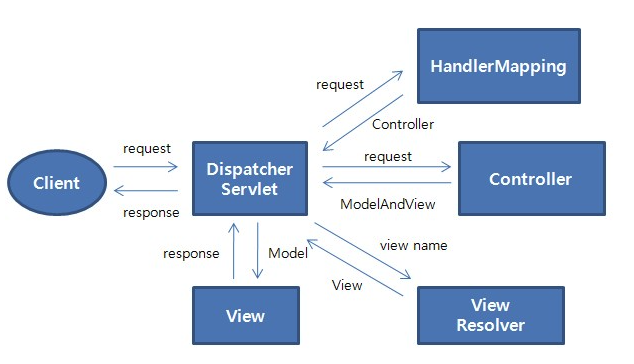

# Spring MVC

## View를 응답하는 경우

이미지 출처 : www.egovframe.go.kr

- 클라이언트로부터 HTTP 요청이 들어옵니다. 이때 DispatcherServlet이 프론트 컨트롤러의 역할을 수행합니다.
- HandlerMapping을 통해 URL에 매핑된 핸들러를 조회합니다.
- DispatcherServlet은 찾은 핸들러를 실행하기 위해 HandlerAdapter를 사용합니다.
- HandlerAdapter가 실제로 요청을 처리하는 메서드를 호출합니다.
- 컨트롤러는 결과 데이터를 Model 객체에 담고, View 이름을 반환합니다.
- ViewResolver는 View 이름을 기반으로 적절한 뷰를 찾습니다.
- ViewResolver가 찾은 뷰를 사용해 최종적으로 HTML과 같은 응답을 생성합니다.

## Message Converter의 동작

JSON과 문자열 등을 응답하는 경우는 View를 응답하는 경우와 유사한 흐름으로 동작합니다. 단, ViewResolver 대신 HttpMessageConverter 가 동작합니다. MessageConverter는 HTTP 요청과 응답 두 경우 모두 사용될 수 있습니다. 이때 클라이언트의 HTTP Accept 헤더와 반환 타입 정보, Content-Type 등을 조합하여 타입에 맞는 HttpMessageConverter가 선택됩니다.

- 클라이언트로부터 HTTP 요청이 들어옵니다. 이때 DispatcherServlet이 Front Controller의 역할을 수행합니다.
- HandlerMapping을 통해 URL에 매핑된 핸들러(컨트롤러)를 조회합니다.
- `@RequestMapping`을 처리하는 핸들러 어댑터인 RequestMappingHandlerAdapter가 ArgumentResolver를 호출해 핸들러가 필요로 하는 파라미터의 값을 생성하고, 컨트롤러 메서드를 호출하면서 값을 넘겨줍니다. 이때 ArgumentResolver가 HttpMessageConverter를 사용해 필요한 객체를 생성합니다.
- 컨트롤러는 전달받은 파라미터를 사용하여 서비스 계층과 데이터 접근 계층을 호출해 비즈니스 로직을 수행합니다.
- `@ResponseBody`와 `HttpEntity`를 처리하는 ReturnValueHandler가 HTTPMessageConverter를 호출해 응답 결과를 만들어냅니다.